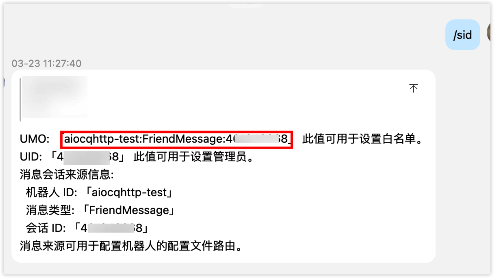
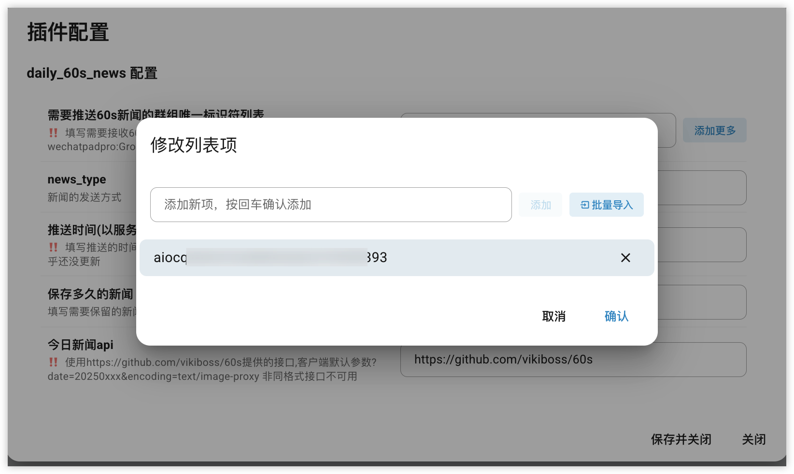

# astrbot_plugin_daily_60s_news

## 项目简介

`astrbot_plugin_daily_60s_news` 是一个为 [AstrBot](https://github.com/AstrBotDevs/AstrBot) 设计的每日 60 秒新闻插件。该插件可自动或手动推送每日新闻（文本或图片）到指定群组，帮助群成员快速获取当天要闻。

## 代码参考
部分代码参考自 [anka-afk/astrbot_plugin_daily_news](https://github.com/anka-afk/astrbot_plugin_daily_news)

## 功能特性

- 支持定时自动推送每日 60 秒新闻（文本或图片）到指定群组
- 支持通过命令获取当天新闻（文本或图片）
- 支持管理员手动推送新闻到群组
- 支持清理过期新闻文件
- 支持查询插件运行状态
- 自动下载并缓存新闻内容，减少重复请求
- 理论上支持目前AstrBot所有平台

## 安装方法

1. 克隆或下载本插件到 AstrBot 插件（/data/plugin/）目录：
   ```bash
   git clone https://github.com/CJSen/astrbot_plugin_daliy_60s_news.git
   ```
2. 进入AstrBot网页插件配置界面，调整相关配置，并保存。

3. groups配置格式，在机器人所在群聊中发送"/sid"获取相关信息。其中SID为群聊ID，即配置页面中的groups参数
/sid回复格式：

将图中红框部分的umo（即sid）复制添加到配置文件中即可：


## 使用方法

- **自动推送**：插件启动后会根据配置的时间自动推送新闻到指定群组。
- **命令获取新闻**：
  - `/新闻 news` 或 `/新闻 早报` 或 `/新闻 新闻`：获取今日新闻（根据配置返回文本或图片）
  - `/新闻 text`：获取今日新闻文本
  - `/新闻 image`：获取今日新闻图片
  - `/新闻 status`：查询插件状态（管理员）
  - `/新闻 clean`：清理过期新闻文件（管理员）
  - `/新闻 push`：手动推送新闻到群组（管理员）


## 项目结构说明

- `main.py`：插件主程序，包含新闻获取、推送、命令注册、定时任务等核心逻辑。
- `metadata.yaml`：插件元数据配置文件。
- `_conf_schema.json`：插件配置项的 JSON Schema。
- `LICENSE`：开源许可证文件。
- `README.md`：项目说明文档。
- `AstrBot数据目录/plugins_data/astrbot_plugin_daily_60s_news/news`：缓存每日新闻的文本和图片文件夹。

## 许可证说明

本项目默认采用 AGPL-3.0 License，详见 LICENSE 文件。
